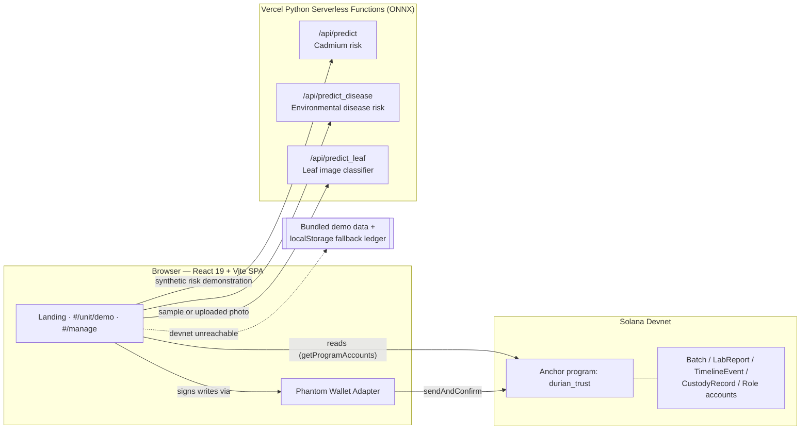

# DurianTrust

**Durian Checker — an academic prototype for batch records and receiver-confirmed custody on Solana Devnet.**

Durian Checker is the product name; DurianTrust is the technical program name. The prototype links user-entered batch records, measurements and signed custody actions. QR links open the record; they do not authenticate the physical fruit, official laboratory certificates or export eligibility.

## The problem

Reports in 2025 describe contamination concerns and tighter controls affecting Vietnamese durian exports. Fragmented laboratory and origin records are a related software problem; this project does not establish what share of rejected shipments results from paperwork. Its research scope is managing, linking, authorizing and auditing evidence associated with a batch, rather than detecting chemicals.

Sources: [VietnamPlus](https://en.vietnamplus.vn/vietnam-steps-up-quality-control-of-durian-exports-to-retain-billion-dollar-market-post321595.vnp) · [MOIT/VNTR](https://vntr.moit.gov.vn/news/china-tightens-import-rules-on-vietnamese-durians) · [Tuổi Trẻ](https://tuoitre.vn/sau-rieng-xuat-khau-sang-trung-quoc-giam-sau-bo-truong-do-duc-duy-chi-dao-loat-giai-phap-20250508164730467.htm) · [SGGP](https://en.sggp.org.vn/vietnams-durian-industry-reeling-as-china-rejects-shipments-over-contaminants-post117622.html)

## The solution

DurianTrust gives every export batch a digital trust layer:

- **An append-only blockchain ledger.** Authorized users can record batch, lab and journey data through Solana transactions; those records preserve what was submitted, not whether physical claims were independently verified.
- **A transferable custody record.** Each batch has an on-chain holder that can move along the supply chain. A handoff takes two signatures: the current holder nominates the next one, and *the recipient must sign to accept*. The program does not let its authority unilaterally change the recorded holder. This digital state does not establish legal title or physical delivery.
- **A Rule-Based Quality Gate.** Entered Cadmium values are compared with a configured demo threshold (default 0.05 ppm). Its legal applicability has not been verified. The output is a deterministic below-threshold/review/hold rule result, not an official compliance decision. Decimal input uses integer units of 0.0001 ppm, rejects excess precision and invalid values, and uses exactly the same units for transaction encoding.
- **AI-assisted screening.** Two tabular ONNX models use synthetic datasets to demonstrate a prediction pipeline; they are not evidence of real-world Cadmium prediction. A leaf image classifier is also available, but dataset provenance/license and independent test performance remain unresolved. Leaf images cannot detect Cadmium or Auramine O.
- **One QR code per batch.** Scanning it opens the same verification page a judge, buyer, or customs officer would see, with the batch's full timeline, custody chain, and ledger proof.

### Why this is an RWA problem, not just a logging problem

A durian batch is a physical asset whose handoffs need a clear record. The Batch PDA links its submitted evidence and the wallet currently recorded as holder; the recipient must accept a proposed transfer. This gives the demo a verifiable digital custody trail. Legal title, liability and physical delivery require evidence outside the program.

The batch is deliberately **not** minted as an SPL/Metaplex NFT. A mint would add mint accounts, ATAs and CPI plumbing while changing nothing about what is actually proven; an NFT would be a wrapper over exactly the state the program already enforces. The program constrains its digital custody state; this is not legal ownership or a guarantee that the correct physical lot was handed over.

## Architecture



The React app is the single source of truth for the UI. It reads batch state directly from Solana devnet program accounts, calls three demonstration inference endpoints, and — only when devnet or Phantom is unavailable — falls back to bundled demo data or a localStorage-simulated ledger. The fallback is never hidden: the UI always shows which mode it's in.

## Judge quickstart

**No wallet required to see it work.** Everything below the fold is real, running code — not mocked screenshots.

1. Open the app and click **"Scan a demo batch"** on the landing page. This lands on `#/unit/demo`, which works with zero setup: no wallet, no devnet SOL, no install step. If devnet happens to be unreachable, the page says so explicitly (a gold "Demo data" badge instead of a green "Live on Solana Devnet" one) and still shows a fully realistic batch record.
2. Look at the **chain of custody** panel next to the timeline. Inspect the selected batch and its data-source badge. Available records may change over time; use captured transaction evidence for a dated scenario. A pending recipient does not become the recorded holder until acceptance.
3. Scroll to the **leaf disease scanner** and click one of the sample thumbnails — it runs the real ONNX model and returns a prediction in one click, no file upload needed.
4. To take custody yourself, open `#/manage` with [Phantom](https://phantom.app/) on **Devnet**. Select a batch for which your wallet is the nominated recipient; only that recipient can sign **Accept custody**. Accepting moves `Batch.owner` and appends a permanent `CustodyRecord`.
5. To try the rest of the **write path** (registering a batch, submitting a lab report, logging a timeline event), grab free devnet SOL from **[faucet.solana.com](https://faucet.solana.com)**. The app detects a missing wallet or an empty devnet balance and tells you what to do. Every submitted form has a **"Fill sample data"** button so you don't have to invent realistic values by hand.

**The rules worth testing.** Try to transfer a batch your wallet doesn't hold — the program rejects it. Current custody instructions do not grant the `config.authority` a unilateral reassignment path. Role administration, program upgrade authority, key compromise and future code changes remain separate governance risks.

## What's on-chain vs. simulated

We'd rather be upfront about this than have you find out mid-demo:

| Feature | Status |
|---|---|
| Batch registration, lab reports, timeline events | **Real** — Solana devnet transactions via the `durian_trust` Anchor program, when a wallet is connected and devnet is reachable. Falls back to a localStorage-simulated ledger otherwise, always clearly badged. |
| Chain of custody (recorded holder transfer) | **Real, and chain-only.** `transfer_custody` + `accept_custody` on devnet, both signatures required. There is deliberately **no fallback** for this one: the localStorage ledger cannot prove a signed custody handoff. Without devnet, the portal refuses and says why. |
| Synthetic risk demonstration (`/api/predict`) | ONNX inference with a local JS fallback (badged). Training data are synthetic; no validated chemical prediction claim. |
| Synthetic disease-risk demonstration (`/api/predict_disease`) | ONNX inference with a local JS fallback. Synthetic pipeline demonstration, not a field-validated risk estimate. |
| Leaf disease image classifier (`/api/predict_leaf`) | **Real** ONNX MobileNetV3 classifier. Independent test accuracy is not verified in this repository; the training notebook reports test metrics only when a separate `test/` split is available. |
| Rule-based quality gate (Cadmium threshold check) | **Deterministic JS**, not AI — this is what actually gets written on-chain as the audit verdict, by design (auditable, not a black box). |
| QR codes | **Real** — generated client-side and encode real deep links back into the app. |
| Transaction proofs / Solana Explorer links | **Real** devnet signatures when on-chain; explicitly labeled `simulated, not on-chain` in fallback mode. |

## Tech stack

- **Frontend:** React 19, Vite, hash-based routing, `lucide-react` icons, hand-rolled dark glassmorphism design system (no CSS framework)
- **Chain:** Solana (devnet), Anchor framework, `@coral-xyz/anchor` + `@solana/web3.js`, Phantom via `@solana/wallet-adapter-react`
- **AI:** ONNX Runtime models served from Python functions on Vercel (Cadmium risk, disease risk, leaf image classification)
- **QR:** `qrcode` for generation, `html5-qrcode` for camera scanning
- **i18n:** Custom bilingual (VI/EN) copy system, no external i18n library

## Setup

Install dependencies:

```bash
npm install
```

Create a local environment file if you need a custom devnet RPC:

```bash
VITE_RPC_URL=https://api.devnet.solana.com
```

Run the app locally:

```bash
npm run dev
```

Open `http://localhost:5173/` and connect Phantom on Solana devnet to submit signed transactions.

Build for production:

```bash
npm run build
```

## Anchor Program

The canonical Anchor source is `program/programs/durian_trust/src/lib.rs`. Build it with Anchor 0.31.1, then run `node scripts/sync-contract.mjs --write` from the app root to refresh the public source and generated IDL. Run `--check` to detect drift. These snapshots describe the local release candidate; they do not prove that this binary is deployed on devnet. See [the contract release guide](program/RELEASE.md) for testing and attestation v2 compatibility.

Solana signing is handled by Phantom in the browser. The old EVM `.env` `PRIVATE_KEY` is no longer required and should not be used by this app.

## App Flows

- `#/`: bilingual product overview for durian traceability, AI screening, and blockchain verification.
- `#/unit/demo`: batch lookup by QR or batch ID, journey timeline, chain of custody, lab report history, and Solana Explorer proof.
- `#/manage`: operator portal for Phantom-signed batch registration, role management, lab report updates, timeline updates, custody handoff and acceptance, QR label generation, and AI model checks.

## Roles vs. custody

These are two different things, and the program treats them that way.

**Roles** (`farmer`, `lab`, `logistics`) are grants from the program authority that say *what kind of write you may perform* — who can register a batch, who can file a lab report, who can log a timeline event. They are revocable and they are not scarce.

**Custody** is the on-chain holder recorded for a specific batch. It is separate from roles and held by exactly one wallet at a time. An importer with no role grant can accept and later hand off a batch; a `logistics` role holder who is not the recorded holder cannot transfer it. This digital record does not establish legal ownership. That's why the custody panel sits outside the role tabs in `#/manage`.

## Testing

```bash
cd program && npm install --legacy-peer-deps && npm test
```

The suite runs the Anchor program in-process with `anchor-bankrun` and covers the custody rules directly: a non-owner cannot propose a handoff, a wallet that was not nominated cannot accept one, ownership does not move until acceptance, and a previous owner cannot move a batch it has already passed on.

> **Note:** these tests do not run on Windows. `solana-bankrun` ships no win32 native binary, and `solana-test-validator` needs symlink privileges. Run them on Linux/macOS or in CI; on Windows, verify against devnet instead.


## Research limitations after panel review

- Frontend lab submissions currently call the legacy numeric-report instruction, not the attestation-v2 instruction. Contract-side v2 support alone does not mean certificate verification is integrated in the UI.
- No authenticated official PUC registry, laboratory PDF verification, temperature sensor feed or customs-system connection is claimed. Yellow O results cannot be inferred from Cadmium or leaf AI.
- QR labels contain unsigned lookup URLs and can be copied; label-to-physical-lot binding is unresolved.
- Public lookup fetches matching chain accounts and then displays at most 200 summaries; this is a client cap, not RPC pagination. The management list fetches all current-layout batch accounts. No production indexer is implemented.
- Browser unit/mock tests demonstrate code behavior, not real-wallet E2E, legal compliance or business impact. See the panel-revision evidence bundle for dated commands and actual outcomes.
