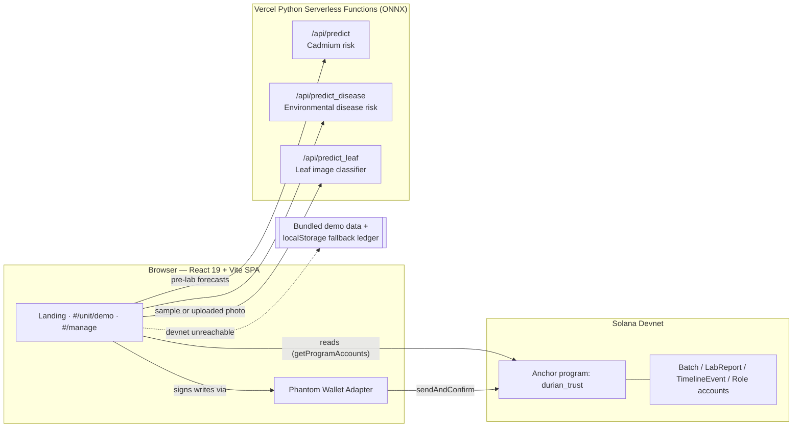

# DurianTrust

**Blockchain-verified durian exports — from farm to customs, in seconds instead of days.**

DurianTrust is a mobile-first traceability app for Vietnamese durian exports. It combines a Solana Anchor ledger, serverless ONNX quality models, and QR-code verification so an inspector, exporter, or customs officer can trace a batch's full journey — and its Cadmium safety record — from a single scan.

## The problem

Since 2025, Chinese customs has tightened import controls on Cadmium and Yellow O (Auramine O) dye in durian shipments. Many of the resulting rejections and delays aren't caused by bad fruit — they're caused by fragmented paperwork: lab certificates on paper or PDF, planting-region codes that get reused or spoofed, and cold-chain records nobody can produce on demand. When a shipment gets flagged, tracing it back to the source orchard can take days, and by then the rest of the batch has already spoiled at the border.

Sources: [VietnamPlus](https://en.vietnamplus.vn/vietnam-steps-up-quality-control-of-durian-exports-to-retain-billion-dollar-market-post321595.vnp) · [MOIT/VNTR](https://vntr.moit.gov.vn/news/china-tightens-import-rules-on-vietnamese-durians) · [Tuổi Trẻ](https://tuoitre.vn/sau-rieng-xuat-khau-sang-trung-quoc-giam-sau-bo-truong-do-duc-duy-chi-dao-loat-giai-phap-20250508164730467.htm) · [SGGP](https://en.sggp.org.vn/vietnams-durian-industry-reeling-as-china-rejects-shipments-over-contaminants-post117622.html)

## The solution

DurianTrust gives every export batch a digital trust layer:

- **An append-only blockchain ledger.** Harvest, lab test, packing, and export are each recorded as a Solana transaction that can't be edited after the fact.
- **A Rule-Based Quality Gate.** Cadmium assay results are checked against the customs safety threshold (0.05 ppm) the moment they're entered, producing an auditable pass/review/hold verdict.
- **AI-assisted screening.** Two ONNX models forecast Cadmium and disease risk *before* a full lab assay is run, and a third classifies durian leaf photos for common diseases — so problems can be caught earlier in the chain.
- **One QR code per batch.** Scanning it opens the same verification page a judge, buyer, or customs officer would see, with the batch's full timeline and ledger proof.

## Architecture



The React app is the single source of truth for the UI. It reads batch state directly from Solana devnet program accounts, calls the three AI endpoints for risk forecasting, and — only when devnet or Phantom is unavailable — falls back to bundled demo data or a localStorage-simulated ledger. The fallback is never hidden: the UI always shows which mode it's in.

## Judge quickstart

**No wallet required to see it work.** Everything below the fold is real, running code — not mocked screenshots.

1. Open the app and click **"Scan a demo batch"** on the landing page. This lands on `#/unit/demo`, which works with zero setup: no wallet, no devnet SOL, no install step. If devnet happens to be unreachable, the page says so explicitly (a gold "Demo data" badge instead of a green "Live on Solana Devnet" one) and still shows a fully realistic batch record.
2. Scroll to the **leaf disease scanner** and click one of the sample thumbnails — it runs the real ONNX model and returns a prediction in one click, no file upload needed.
3. To try the **write path** (registering a batch, submitting a lab report, logging a timeline event), open `#/manage`, install [Phantom](https://phantom.app/), switch it to **Devnet**, and grab free devnet SOL from **[faucet.solana.com](https://faucet.solana.com)**. The app detects a missing wallet or an empty devnet balance and tells you what to do. Every submitted form has a **"Fill sample data"** button so you don't have to invent realistic values by hand.

## What's on-chain vs. simulated

We'd rather be upfront about this than have you find out mid-demo:

| Feature | Status |
|---|---|
| Batch registration, lab reports, timeline events | **Real** — Solana devnet transactions via the `durian_trust` Anchor program, when a wallet is connected and devnet is reachable. Falls back to a localStorage-simulated ledger otherwise, always clearly badged. |
| Cadmium risk pre-lab forecast (`/api/predict`) | **Real** ONNX model on Vercel serverless. Falls back to a local JS heuristic if the function is unreachable (also badged). |
| Disease risk forecast (`/api/predict_disease`) | **Real** ONNX model on Vercel serverless, same fallback behavior. |
| Leaf disease image classifier (`/api/predict_leaf`) | **Real** ONNX MobileNetV3 classifier (~88% accuracy on the held-out test set). |
| Rule-based quality gate (Cadmium threshold check) | **Deterministic JS**, not AI — this is what actually gets written on-chain as the audit verdict, by design (auditable, not a black box). |
| QR codes | **Real** — generated client-side and encode real deep links back into the app. |
| Transaction proofs / Solana Explorer links | **Real** devnet signatures when on-chain; explicitly labeled `simulated, not on-chain` in fallback mode. |

## Tech stack

- **Frontend:** React 19, Vite, hash-based routing, `lucide-react` icons, hand-rolled dark glassmorphism design system (no CSS framework)
- **Chain:** Solana (devnet), Anchor framework, `@coral-xyz/anchor` + `@solana/web3.js`, Phantom via `@solana/wallet-adapter-react`
- **AI:** ONNX Runtime models served from Python functions on Vercel (Cadmium risk, disease risk, leaf image classification)
- **QR:** `qrcode` for generation, `html5-qrcode` for camera scanning
- **i18n:** Custom bilingual (VI/EN) copy system, no external i18n library

## Setup

Install dependencies:

```bash
npm install
```

Create a local environment file if you need a custom devnet RPC:

```bash
VITE_RPC_URL=https://api.devnet.solana.com
```

Run the app locally:

```bash
npm run dev
```

Open `http://localhost:5173/` and connect Phantom on Solana devnet to submit signed transactions.

Build for production:

```bash
npm run build
```

## Anchor Program

The Anchor program is maintained and deployed through Solana Playground on devnet. After a Playground build/deploy, export the updated IDL and program address into `public/solana/idl.json` so the React app can derive the correct PDAs and submit transactions.

Solana signing is handled by Phantom in the browser. The old EVM `.env` `PRIVATE_KEY` is no longer required and should not be used by this app.

## App Flows

- `#/`: bilingual product overview for durian traceability, AI screening, and blockchain verification.
- `#/unit/demo`: batch lookup by QR or batch ID, journey timeline, lab report history, and Solana Explorer proof.
- `#/manage`: operator portal for Phantom-signed batch registration, role management, lab report updates, timeline updates, QR label generation, and AI model checks.
