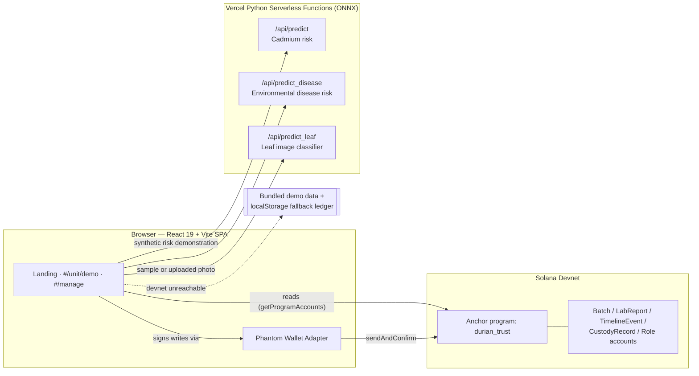

# DurianTrust

**DurianTrust — batch records, declared evidence and buyer QR sharing, with separate Solana Devnet and AI experiments.**

The practical workflow is for a grower or cooperative: create a private batch, record variety and weight, attach photos/documents with a source and date, add journey events, then publish a buyer QR. Files and statements are supplied by the owner; neither a QR nor the completeness checklist authenticates physical fruit, laboratory certificates or export eligibility.

`#/manage` is the cloud workspace. `#/records/example` is a read-only sample, clearly labeled and never uploaded. `#/manage/solana` contains the separate custody and AI experiments; cloud batches do not sync to them. The user confirmed Google sign-in reaches the management screen. Email sign-in still needs SMTP for broader use. Authenticated creation, file upload and public/private access on production remain unverified end to end.

## For team review

- [Live web app](https://durian-web3.vercel.app/) and [Corelia project](https://app.corelia.academy/projects/duriantrust)
- [Current 10-minute Morph deck (59 steps + AI appendix)](submission/presentation/output/DurianTrust_Morph_59_VI-HTX-v7.pptx), [short deck (19 slides + AI appendix)](submission/presentation/output/DurianTrust_Core_19_VI-HTX-v7.pptx), [speaker notes](submission/presentation/output/Speaker_Notes_VI_10min_HTX.md), and [Vietnamese script PDF](output/pdf/DurianTrust_Kich_ban_thuyet_trinh_10_phut_v5.pdf)
- [90-second workflow video](public/submission/DurianTrust_HTX_Demo_90s.mp4): local UI with simulated auth/API, not a field pilot or verified production recording
- [External leaf-model evaluation](submission/review/ai-training/MENDELEY_EXTERNAL_EVAL.md) and [backend setup](backend/README.md)

The leaf model file configured in this repo got 80/202 (39.6%) across three matched classes on the external-source check, including 0/59 Phomopsis. This is not a proven independent field test or a chemical safety assessment. The model running on Render has not been hash-verified against the repo file.

## The problem

Reports in 2025 describe contamination concerns and tighter controls affecting Vietnamese durian exports. Fragmented laboratory and origin records are a related software problem; this project does not establish what share of rejected shipments results from paperwork. Its research scope is managing, linking, authorizing and auditing evidence associated with a batch, rather than detecting chemicals.

Market concentration is a central motivation: the [government briefing on 2026-09-03](https://baochinhphu.vn/hop-bao-chinh-phu-thuong-ky-thang-8-dai-dien-bo-cong-an-lam-ro-nhieu-van-de-duoc-quan-tam-102260903170016698.htm) estimated that China accounted for approximately 95% of Vietnam's durian export value in January–August 2026, around USD 1.85 billion out of USD 1.95 billion. This makes that market's quality and traceability requirements particularly important. These figures are period-specific estimates, not a permanent market share or evidence of this prototype's impact.

The original motivation combines quality-control concerns with traceability requirements. The [Plant Protection Department's 2022 explanation](https://sansangxuatkhau.ppd.gov.vn/tin-tuc-su-kien/sau-rieng-duoc-xuat-khau-chinh-ngach-sang-trung-quoc.html) describes record keeping and traceability to growing areas. This motivates testing a batch dossier workflow; it does not prove demand for this website. The team confirmed on 2026-09-28 that it has no field pilot, original dataset provenance documentation or real laboratory measurements available. Proposed first users are growers/cooperatives preparing records for buyers. Time savings and business impact remain hypotheses.

Sources: [VietnamPlus](https://en.vietnamplus.vn/vietnam-steps-up-quality-control-of-durian-exports-to-retain-billion-dollar-market-post321595.vnp) · [MOIT/VNTR](https://vntr.moit.gov.vn/news/china-tightens-import-rules-on-vietnamese-durians) · [Tuổi Trẻ](https://tuoitre.vn/sau-rieng-xuat-khau-sang-trung-quoc-giam-sau-bo-truong-do-duc-duy-chi-dao-loat-giai-phap-20250508164730467.htm) · [SGGP](https://en.sggp.org.vn/vietnams-durian-industry-reeling-as-china-rejects-shipments-over-contaminants-post117622.html)

## The solution

The cloud workspace provides private records, append-only evidence metadata and event history, and explicit QR publication using [Render + Supabase](backend/README.md). The following capabilities are separate research/demo tools:

- **An append-only blockchain ledger.** Authorized users can record batch, lab and journey data through Solana transactions; those records preserve what was submitted, not whether physical claims were independently verified.
- **A transferable custody record.** Each batch has an on-chain holder that can move along the supply chain. A handoff takes two signatures: the current holder nominates the next one, and *the recipient must sign to accept*. The program does not let its authority unilaterally change the recorded holder. This digital state does not establish legal title or physical delivery.
- **A Rule-Based Quality Gate.** Entered Cadmium values are compared with a configured demo threshold (default 0.05 ppm). Its legal applicability has not been verified. The output is a deterministic below-threshold/review/hold rule result, not an official compliance decision. Decimal input uses integer units of 0.0001 ppm, rejects excess precision and invalid values, and uses exactly the same units for transaction encoding.
- **AI-assisted screening.** Two tabular ONNX models use synthetic datasets to demonstrate a prediction pipeline; they are not evidence of real-world Cadmium prediction. The leaf classifier has a [cross-source check](submission/review/ai-training/MENDELEY_EXTERNAL_EVAL.md), but its original training provenance and field performance remain unresolved. Leaf images cannot detect Cadmium or Auramine O.
- **One QR code per batch.** Scanning it opens the same verification page a judge, buyer, or customs officer would see, with the batch's full timeline, custody chain, and ledger proof.

### Scope of digital custody

A durian batch is a physical asset whose handoffs need a clear record. The Batch PDA links its submitted evidence and the wallet currently recorded as holder; the recipient must accept a proposed transfer. This gives the demo a verifiable digital custody trail. Legal title, liability and physical delivery require evidence outside the program.

The batch is deliberately **not** minted as an SPL/Metaplex NFT. A mint would add mint accounts, ATAs and CPI plumbing while changing nothing about what is actually proven; an NFT would be a wrapper over exactly the state the program already enforces. The program constrains its digital custody state; this is not legal ownership or a guarantee that the correct physical lot was handed over.

## Architecture

The primary workspace uses React on Vercel, Google sign-in through Supabase Auth, a Render API forwarding each user's JWT, PostgreSQL with RLS, and private Supabase Storage. Buyers can read explicitly published batch records without a wallet. Batch owners manage their declared details and append evidence/events; database administrators retain administrative control. A cloud delivery event is a one-sided declaration.

### Separate Solana and inference experiments


```mermaid
flowchart LR
    subgraph Client["Browser — React 19 + Vite SPA"]
        UI["Landing · #/unit/demo · #/manage"]
        Phantom["Phantom Wallet Adapter"]
    end

    subgraph Devnet["Solana Devnet"]
        Program["Anchor program: durian_trust"]
        PDAs["Batch / LabReport / TimelineEvent /\nCustodyRecord / Role accounts"]
    end

    subgraph AI["Vercel Python Serverless Functions (ONNX)"]
        Predict["/api/predict\nCadmium risk"]
        Disease["/api/predict_disease\nEnvironmental disease risk"]
        Leaf["/api/predict_leaf\nLeaf image classifier"]
    end

    Fallback[["Bundled demo data +\nlocalStorage fallback ledger"]]

    UI -- "reads (getProgramAccounts)" --> Program
    UI -- "signs writes via" --> Phantom
    Phantom -- "sendAndConfirm" --> Program
    Program --- PDAs
    UI -- "synthetic risk demonstration" --> Predict
    UI --> Disease
    UI -- "sample or uploaded photo" --> Leaf
    UI -. "devnet unreachable" .-> Fallback
```

The experimental views read batch state from Solana program accounts and call demonstration inference endpoints. Some ledger forms offer a separately labeled local simulation. Custody has no simulated acceptance path. Cloud records, local simulations and chain state are independent; the app does not synchronize them.

The [Render + Supabase backend](backend/README.md) supports the primary workspace:
Google sign-in, private off-chain batch records, evidence files, append-only event
history, and public QR sharing. It does not replace Solana custody or silently
upload the local demo ledger. The diagram above describes the experimental path.

## Judge quickstart

**No wallet required to inspect the sample buyer record.** The production cloud workflow still needs an authenticated end-to-end check.

Current pitch deck: [DurianTrust_Morph_59_VI-HTX-v7.pptx](submission/presentation/output/DurianTrust_Morph_59_VI-HTX-v7.pptx), with technology logos and a clearer Supabase wordmark. Detailed AI evaluation is in the appendix after the 10-minute pitch. The v5 script PDF remains compatible with this visual update. The root-level `DurianTrust_Pitch_Deck.pptx` is an older version.

Current workflow video: [DurianTrust_HTX_Demo_90s.mp4](public/submission/DurianTrust_HTX_Demo_90s.mp4). It uses local simulated auth/API and does not demonstrate production access or a real HTX pilot.

Captioned product introduction: [DurianTrust_Intro_73s.mp4](public/DurianTrust_Intro_73s.mp4). This is a code-rendered explainer, not a recording of product interaction; the hackathon backup demo video must show real app use.

Guided UI simulation: [DurianTrust_Guided_Walkthrough_72s.mp4](public/DurianTrust_Guided_Walkthrough_72s.mp4). A cursor and highlights walk through the real product flow using a code-rendered recreation of the interface. It is labeled as a simulation throughout and is not the required screen recording.

1. Open `#/records/example` to inspect the sample buyer record without signing in. Use Google sign-in at `#/manage` for your own batches. To inspect the independent Solana demo, open `#/unit/demo`; its source badge distinguishes chain data from bundled samples.
2. Look at the **chain of custody** panel next to the timeline. Inspect the selected batch and its data-source badge. Available records may change over time; use captured transaction evidence for a dated scenario. A pending recipient does not become the recorded holder until acceptance.
3. Scroll to the **leaf disease scanner** and click one of the sample thumbnails — it runs the real ONNX model and returns a prediction in one click, no file upload needed.
4. To take custody yourself, open `#/manage/solana` with [Phantom](https://phantom.app/) on **Devnet**. Select a batch for which your wallet is the nominated recipient; only that recipient can sign **Accept custody**. Accepting moves `Batch.owner` and appends a permanent `CustodyRecord`.
5. To try the rest of the **write path** (registering a batch, submitting a lab report, logging a timeline event), grab free devnet SOL from **[faucet.solana.com](https://faucet.solana.com)**. The app detects a missing wallet or an empty devnet balance and tells you what to do. Every submitted form has a **"Fill sample data"** button so you don't have to invent realistic values by hand.

**The rules worth testing.** Try to transfer a batch your wallet doesn't hold — the program rejects it. Current custody instructions do not grant the `config.authority` a unilateral reassignment path. Role administration, program upgrade authority, key compromise and future code changes remain separate governance risks.

## What's on-chain vs. simulated

We'd rather be upfront about this than have you find out mid-demo:

| Feature | Status |
|---|---|
| Batch registration, lab reports, timeline events | **Real** — Solana devnet transactions via the `durian_trust` Anchor program, when a wallet is connected and devnet is reachable. Falls back to a localStorage-simulated ledger otherwise, always clearly badged. |
| Chain of custody (recorded holder transfer) | **Real, and chain-only.** `transfer_custody` + `accept_custody` on devnet, both signatures required. There is deliberately **no fallback** for this one: the localStorage ledger cannot prove a signed custody handoff. Without devnet, the portal refuses and says why. |
| Synthetic risk demonstration (`/api/predict`) | ONNX inference with a local JS fallback (badged). Training data are synthetic; no validated chemical prediction claim. |
| Synthetic disease-risk demonstration (`/api/predict_disease`) | ONNX inference with a local JS fallback. Synthetic pipeline demonstration, not a field-validated risk estimate. |
| Leaf disease image classifier (`/api/predict_leaf`) | ONNX classifier for screening only. The repo's API model file got 80/202 (39.6%) on three matched classes from Mendeley Data v2, with Phomopsis at 0/59; see the [protocol and limits](submission/review/ai-training/MENDELEY_EXTERNAL_EVAL.md). This does not establish field accuracy or identify the live Render model hash. |
| Rule-based quality gate (Cadmium threshold check) | **Deterministic JS**, not AI — this is what actually gets written on-chain as the audit verdict, by design (auditable, not a black box). |
| QR codes | **Real** — generated client-side and encode real deep links back into the app. |
| Transaction proofs / Solana Explorer links | **Real** devnet signatures when on-chain; explicitly labeled `simulated, not on-chain` in fallback mode. |

## Tech stack

- **Frontend:** React 19, Vite, hash-based routing, `lucide-react` icons, hand-rolled dark glassmorphism design system (no CSS framework)
- **Chain:** Solana (devnet), Anchor framework, `@coral-xyz/anchor` + `@solana/web3.js`, Phantom via `@solana/wallet-adapter-react`
- **AI:** ONNX Runtime models served from Python functions on Vercel (Cadmium risk, disease risk, leaf image classification)
- **QR:** `qrcode` for generation, `html5-qrcode` for camera scanning
- **i18n:** Custom bilingual (VI/EN) copy system, no external i18n library

## Setup

Install dependencies:

```bash
npm install
```

Create a local environment file if you need a custom devnet RPC:

```bash
VITE_RPC_URL=https://api.devnet.solana.com
```

Run the app locally:

```bash
npm run dev
```

Open `http://localhost:5173/` and connect Phantom on Solana devnet to submit signed transactions.

Build for production:

```bash
npm run build
```

## Anchor Program

The canonical Anchor source is `program/programs/durian_trust/src/lib.rs`. Build it with Anchor 0.31.1, then run `node scripts/sync-contract.mjs --write` from the app root to refresh the public source and generated IDL. Run `--check` to detect drift. These snapshots describe the local release candidate; they do not prove that this binary is deployed on devnet. See [the contract release guide](program/RELEASE.md) for testing and attestation v2 compatibility.

Solana signing is handled by Phantom in the browser. The old EVM `.env` `PRIVATE_KEY` is no longer required and should not be used by this app.

## App Flows

- `#/`: bilingual product overview for durian traceability, AI screening, and blockchain verification.
- `#/unit/demo`: batch lookup by QR or batch ID, journey timeline, chain of custody, lab report history, and Solana Explorer proof.
- `#/manage`: operator portal for Phantom-signed batch registration, role management, lab report updates, timeline updates, custody handoff and acceptance, QR label generation, and AI model checks.

## Roles vs. custody

These are two different things, and the program treats them that way.

**Roles** (`farmer`, `lab`, `logistics`) are grants from the program authority that say *what kind of write you may perform* — who can register a batch, who can file a lab report, who can log a timeline event. They are revocable and they are not scarce.

**Custody** is the on-chain holder recorded for a specific batch. It is separate from roles and held by exactly one wallet at a time. An importer with no role grant can accept and later hand off a batch; a `logistics` role holder who is not the recorded holder cannot transfer it. This digital record does not establish legal ownership. The custody panel is in the experimental `#/manage/solana` workspace.

## Testing

Build the program, then run the native-validator suites from `program/`:

```bash
npm ci --legacy-peer-deps
TEST_VALIDATOR_PATH="$(command -v solana-test-validator)" npm run test:attestation
TEST_VALIDATOR_PATH="$(command -v solana-test-validator)" npm run test:panel
```

The suites use generated wallets and an isolated local validator to check native Ed25519 attestation, custody acceptance, role restrictions, pause and authority handover. On Windows PowerShell, set `$env:TEST_VALIDATOR_PATH` to the full path of `solana-test-validator.exe` before each command. The older `npm test` bankrun suite remains manual; its genesis-authority fixture requires a specific signer.


## Research limitations after panel review

- Frontend lab submissions currently call the legacy numeric-report instruction, not the attestation-v2 instruction. Contract-side v2 support alone does not mean certificate verification is integrated in the UI.
- No authenticated official PUC registry, laboratory PDF verification, temperature sensor feed or customs-system connection is claimed. Yellow O results cannot be inferred from Cadmium or leaf AI.
- QR labels contain unsigned lookup URLs and can be copied; label-to-physical-lot binding is unresolved.
- Public lookup fetches matching chain accounts and then displays at most 200 summaries; this is a client cap, not RPC pagination. The management list fetches all current-layout batch accounts. No production indexer is implemented.
- Browser unit/mock tests demonstrate code behavior, not real-wallet E2E, legal compliance or business impact. On 2026-09-28, the rule/unit regression tests passed (72 tests), source/IDL sync check passed, and the existing local binary passed native-validator attestation (19) and custody/authority (20) tests. No Devnet deployment was verified or changed in these checks.

### Why Solana remains an experiment

The current dossier workflow can use an ordinary database with access controls. Solana is used to explore a recipient-signed custody trail across wallets; this repository does not demonstrate that it is superior to a permissioned network such as Hyperledger Fabric or necessary for cooperative adoption. Selecting a production ledger requires partner governance, confidentiality requirements and a measured comparison. Current chain account fields and transaction data are public; private cloud records do not make that experimental chain data confidential. Do not submit business secrets to the Devnet demonstration. File hashes alone would not authenticate an issuer or physical sample.
